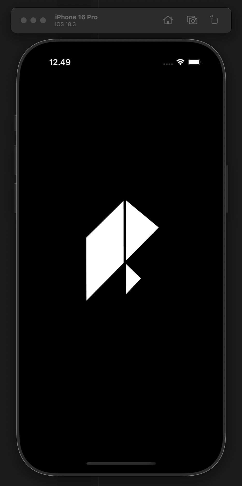
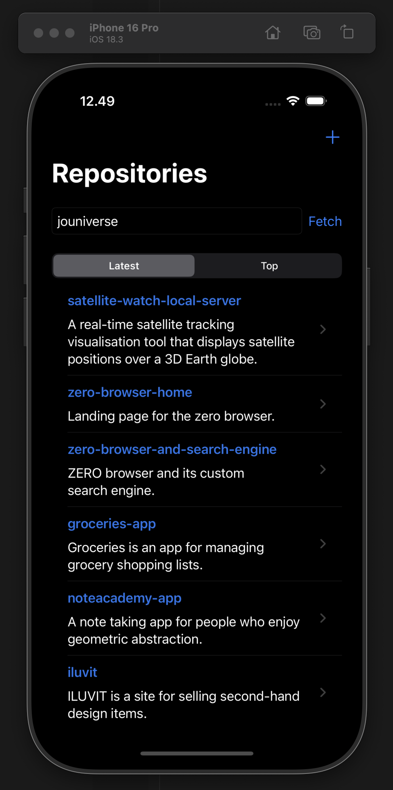
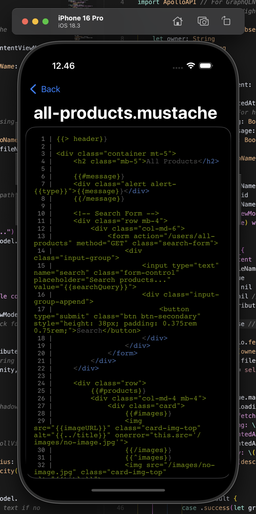

# Repo Man

Repo Man is a small GitHub App for iOS that helps you monitor repositories.

# Features

- See the latest repositories created by a user
- See the top repositories of a user
- Create a repository

# Installation

Create a GitHub access token, so you can use the GitHub API1. You can do this by going to your GitHub settings, then Developer settings, and finally Personal access tokens. Make sure to give it the `repo` scope.

Add the token to your environment variables (Edit Schema > Run > Arguments) as `GITHUB_ACCESS_TOKEN`.

# UI

Walkthrough of the app is available [here](https://youtu.be/QM2q1P5KM2A).

# License

MIT License

# References

1 [GitHub GraphQL API](https://docs.github.com/en/graphql)
